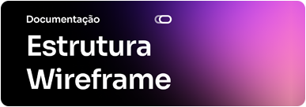
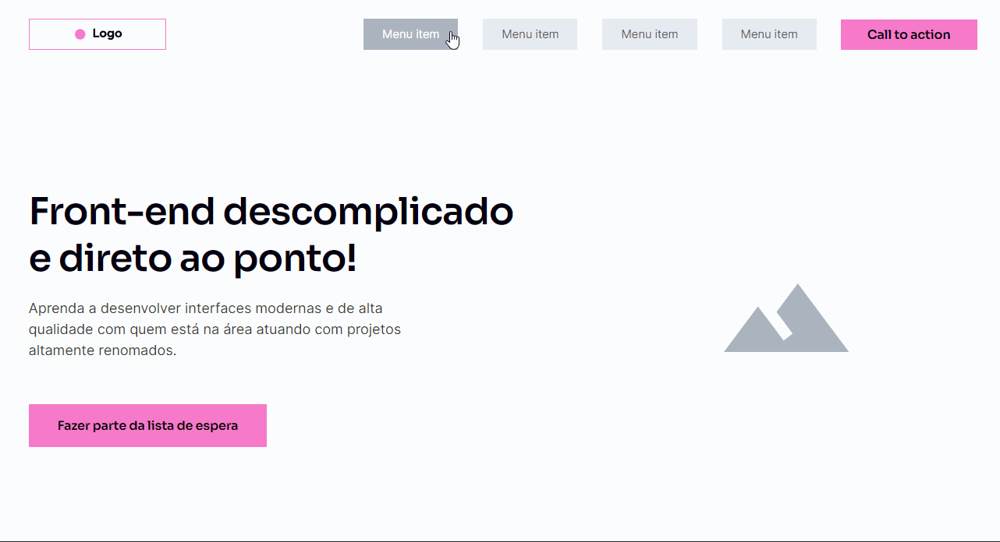

<h1 align="center">
     
    
     
</h1>

 Visualize o projeto:
    https://goharajunior.github.io/lp-wireframe/

    

 
 

## ⚡ Foi usado

    &nbsp;
    &nbsp;

## ℹ️ Como Usar

#### ⚙️ Requisitos

&nbsp;

#### Iniciando o Desenvolvimento

- Clonar o repositorio em sua máquina
- Iniciar com a extensão [Live Server](https://marketplace.visualstudio.com/items?itemName=ritwickdey.LiveServer)